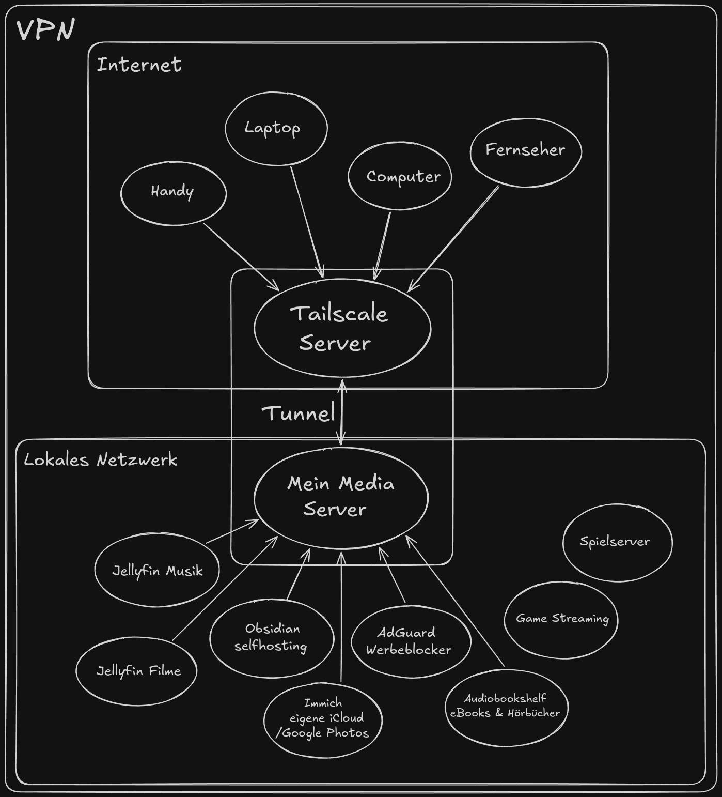

## Intro

Zunächst eine Erklärung was das Gesamtkonzept ist. Der Server kann entweder etwas was auf ihm gespeichert ist zur Verfügung stellen, oder vice versa Speicherplatz zur Verfügung stellen damit ihr keine großen Datenmengen bei euch lagern müsst. Außerdem kann er euch seine Rechenleistung zur Verfügung stellen, z.B. für Minecraft Server oder am Ende sogar lokale KI, aber dafür hab ich noch keine Grafikkarte und die Modelle sind momentan noch zu groß und brauchen ultra High-End Computer um mit Gemini oder ChatGPT oder so halbwegs konkurrieren zu können.

Aber egal was auf dem Server läuft, ist in Containern, die man über eine Internetadresse besuchen kann. Meine Blu-Ray Sammlung beispielsweise läuft mit dem Bibliotheksverwaltungsprogramm Jellyfin unter der Adresse 192.168.0.182:8095. 
Kleine Erklärung zu diesen Adressen:

192.168.0 is ganz schlicht gesagt das Präfix zu allem was im lokalen Netzwerk ist. Jedes Gerät hat dann nur noch eine ID die man dranhängt. Der Server hat die ID 182. Dadurch hat er die IP in meinem lokalen Netzwerk von 192.168.0.182. Euer Handy könnte zb die ID 45 oder so haben und dann die IP adresse 192.168.0.45. 

Wenn ihr einen Service vom Router benutzen wollt braucht ihr also einmal die IP Adresse, aber weil dem Server vom Router nur 1 IP Adresse zugeteilt wird, öffnet er für jeden Service nochmal einen eigenen Port über den nur dieser eine Service läuft. Jellyfin Filme hat die Port Nummer 8095, werdet ihr in eurem Browser (oder der Desktop Anwendung die ich sehr empfehle) unter 192.168.0.182:8095 benutzen können. Jellyfin Musik hat 192.168.0.182:8096, ist also der Nachbar von eins drüber. Um aber wirklich bei meinem Jellyfin zu landen müsst ihr aber im gleichen Netzwerk wie mein Server sein.

## Tailscale Install

Da mein Heimnetz aber abgeschlossen ist und keine externen Zugriffe zulässt, müsst ihr euch zu mir reintunneln. Dafür brauchen wir Tailscale. Das ist mehr oder weniger unser eigener VPN. Ihr aktiviert Tailscale auf eurem Gerät, werdet damit zu einem Tailscale server verbunden, der euch wiederum direkt an meinen Server weiterleitet (da dieser die "Exit Node" in unserem Subnetz ist) und ihr landet in dem Netzwerk in dem sich mein Server befindet. Jetzt funktionieren auch die Zugriffe zum Server.

Tailscale könnt ihr hier herunterladen: https://tailscale.com/download

An sich klappt das mit jedem Gerät, gerade bei mobilen Geräten macht das auch zum Filme, Musik oder Hörbücher hören für unterwegs sehr viel Sinn. Eure Internetgeschwindigkeit wird null beeinträchtigt und ihr seid dazu noch etwas privater Unterwegs weil random IP Adresse in einem Subnetz von Tailscale.

Da ihr jetzt im Netzwerk seid, könnt ihr die folgenden Dienste alle nutzen:

## Table of Contents
* [Jump to Jellyfin Filme](#jellyfin-filme)
* [Jump to Jellyfin Musik](#jellyfin-musik)
Jellyfin Musik
Obsidian Self Hosting
Immich
Audiobookshelf

##Jellyfin Filme

##Jellyfin Musik

